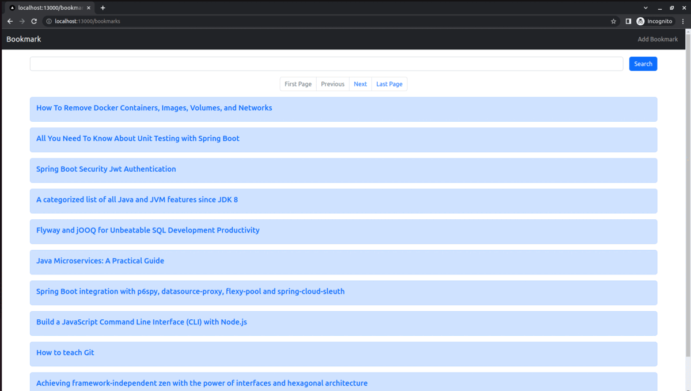

## bookmarker

This repository is hands-on implementation of Bookmarker application from
[SpringBoot + Kubernetes Playlist](https://www.youtube.com/playlist?list=PLuNxlOYbv61h66_QlcjCEkVAj6RdeplJJ) <br/>
by [Siva](https://www.sivalabs.in/about-me/) meant for learning and practice <br/>

The application functionality is: 
   * Show bookmarks (max 10 per page)
   * Support adding a new bookmark with title and url
   * Search / Filter bookmarks based on title of the bookmark
   * Support basic pagination: jump to previous page, next page, first page and last page of bookmarks


### Screenshot




### Technologies

The code has following modules: <br/>

<b>bookmarker-api</b>:
   * [Spring-Boot](https://docs.spring.io/spring-boot/docs/current/reference/htmlsingle/)
   * [Spring-Data-Jpa: makes database access and pagination easier](https://spring.io/projects/spring-data-jpa)
   * [Flyway: for db migrations](https://documentation.red-gate.com/fd/why-database-migrations-184127574.html)
   * [testcontainers: carry out integration testing with external services using containers ](https://java.testcontainers.org/)
   * [jib-maven-plugin: to dockerize the spring boot app without writing dockerfile](https://github.com/GoogleContainerTools/jib/tree/master/jib-maven-plugin)
   * [Postgresql](https://www.postgresql.org/) 
<br/>

<b>bookmarker-ui-nextjs</b>: 
   * [ReactJs](https://react.dev/) with [NextJs](https://nextjs.org/),
   * [Bootstrap](https://getbootstrap.com/)
<br/>

for <em>deployment</em>: 
   * [GitHub Actions for CI/CD - build docker images and push to dockerhub](https://docs.github.com/en/actions/learn-github-actions/understanding-github-actions): checkout [bookmarker-app/.github/worflows/build.yml](https://github.com/aditya-suripeddi/bookmarker-app/blob/master/.github/workflows/build.yml)
   * [docker-compose (for local development)](https://docs.docker.com/compose/)
   * [kind (for creating a local k8s cluster and deploying in it)](https://kind.sigs.k8s.io/) and
   * [lens (for inspecting k8s cluster)](https://k8slens.dev/desktop.html)<br/>

### Running locally

```bash
  # make sure you have docker installed on your machine  
  $ git clone https://github.com/aditya-suripeddi/bookmarker-app.git
  
  $ cd bookmarker-api # go to root directory 
  
  [/path/to/bookmarker-api] $ ./run.sh  # wait for docker runtime to build and run the containers  
```

  Go to [localhost:13000](http://localhost:13000)


```bash
  # to stop the containers and remove the containers:
   [/path/to/bookmarker-api] $ ./run.sh stop  
   
  # note: the images will still be present when you run:
  $ docker images -a 
  
  # to remove the images:
  $ docker rmi bookmarker-ui-nextjs bookmarker-api:latest postgres:14-alpine
  
```

### Running on k8s

```bash

  # make sure you install kind
  $ cd bookmarker-api/kind
  
  [/path/to/bookmarker-api/kind] $ ./create-cluster.sh  # wait for kind to spin up `sb-k8s-series` cluster 
         :
         :
   "Your cluster is ready to use"
  
  [/path/to/bookmarker-api/kind] $ kubectl apply -f ../k8s/
   
```
Go to [localhost:80](http://localhost:80)  or [localhost](http://localhost)

Install [lens](https://k8slens.dev/desktop.html) to inspect the cluster.

To remove the cluster:

```bash  
  
 
  [/path/to/bookmarker-api/kind] $  kubectl delete -f ../k8s/
  
  [/path/to/bookmarker-api/kind] $ ./destroy-cluster.sh
  Destroying k8s cluster ...
  Deleting cluster "sb-k8s-series" ...
  
  # remove images with tag <none> ( dangling images )
  # https://stackoverflow.com/questions/33913020/docker-remove-none-tag-images
  # https://stackoverflow.com/a/50040332
  [/path/to/bookmarker-api/kind] $ docker images -a | grep none | awk '{ print $3; }' | xargs docker rmi
```

### Future Work

* Handle error responses returned by <em>bookmarker-api</em> on <em>bookmarker-ui-nextjs</em> 
* Write unit tests for </em>bookmarker-ui-nextjs</em>

### References

1.  [SivaLabs Youtube Channel](https://www.youtube.com/c/SivaLabs)

2.  *<em>Refer</em>  [bookmarker-app/notes/api-concepts.md](https://github.com/aditya-suripeddi/bookmarker-app/blob/master/notes/api-concepts.md) and <br>
    [bookmarker-app/notes/ui-concepts.md](https://github.com/aditya-suripeddi/bookmarker-app/blob/master/notes/ui-concepts.md) for concepts explored
