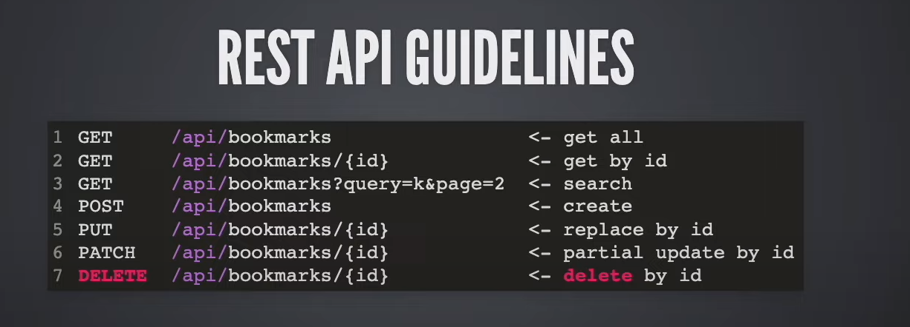
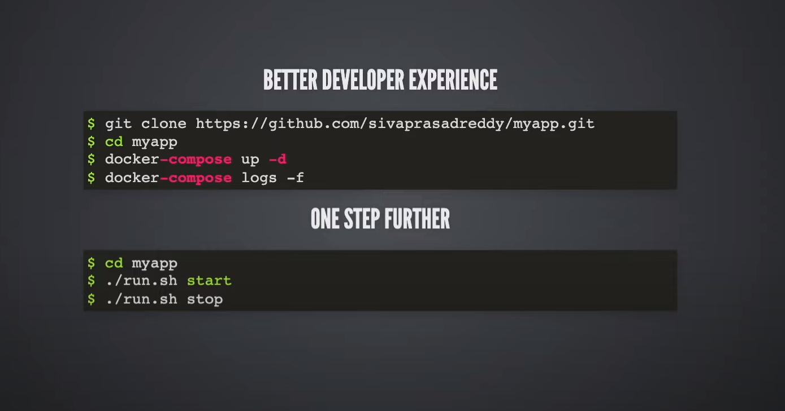

## Notes 

The following sections give gist of some of concepts covered for quick recap

<br>
<br>

#### Overview of pom.xml
<br>
<u>Dependencies / libraries defined:</u>

| s.no | artefactId                          | groupId                    | scope   | optional | purpose                                                                                                                             |
|-----|-------------------------------------|----------------------------|---------|----------|-------------------------------------------------------------------------------------------------------------------------------------|
| 1.  | spring-boot-starter-data-jpa        | org.springframework.boot   |         |          | Starter for using Spring Data JPA with Hibernate                                                                                    |     
| 2.  | spring-boot-starter-validation      | org.springframework.boot   |         |          | Bean Validation with Hibernate validator                                                                                            |
| 3.  | spring-boot-starter-web             | org.springframework.boot   |         |          | Build web, including RESTful apps using Spring MVC. Uses Tomcat as default embedded conatiner                                       |
| 4.  | flyway-core                         | org.flywaydb               |         |          | Flyway is an open-source database migration tool that strongly favors simplicity and convention over configuration                  |
| 5.  | spring-boot-dev-tools               | org.spring.framework.boot  | runtime |  true    | Provides fast app restarts, LiveReload and configurations for enhanced developer experience                                         |
| 6.  | h2                                  | com.h2database             | runtime |          |                                                                                                                                     | 
| 7.  | postgresql                          | org.postgresql             | runtime |          |                                                                                                                                     | 
| 8.  | spring-boot-configuration-processor | org.springframework.boot   |         |  true    | Spring Boot Configuration Annotation Processor                                                                                      |
| 9.  | lombok                              | org.projectlombok          |         |  true    | Java annotation library that helps to reduce boilerplate code                                                                       |
| 10. | spring-boot-starter-test            | org.springframework.boot   | test    |          | tarter for testing Spring Boot applications with libraries including </em>JUnit Jupiter, Hamcrest and Mockito</em>                  |  
| 11. | junit-jupiter                       | org.testcontainers         | test    |          | Junit Jupiter Extension (Integration test platform/framework) by Testcontainers (read the blog)                                     |
| 12. | postgresql                          | org.testcontainers         | test    |          | // for loading postgresql container (JDBC support page)                                                                             | 
| 13. | problem-spring-web                  | org.zalando                |         |          | Problem Spring Web is a set of libraries that makes it easy to produce application/problem+json responses from a Spring application | 

<u>plugins</u>

| s.no | plugin name       | remarks                           | 
|------|-------------------|-----------------------------------|
| 1.   | spring-boot-maven | build fatjar / build docker image |
| 2 .  | jib               | build docker image                | 

 <br>

 <u>dependency management</u>: 

 ```xml

<dependencyManagement>
    <dependencies>
        <dependency>
            <groupId>org.testcontainers</groupId>
            <artifactId>testcontainers-bom</artifactId>
            <version>${testcontainers.version}</version> // avoid repeating version for each test-container dependancy in pom.xml
            <type>pom</type>
            <scope>import</scope>
        </dependency>
    </dependencies>
</dependencyManagement>
 ```

<br>
<br>


#### Rest API guidelines overview:

<br>



<br>
<br>

#### Favor Construction Injection

<br>

Prefer construction injection with lombok's  `@RequiredArgsConstructor` over field injection with spring's `@Autowired`

[What is Spring Framework ? An Unorthodox Guide ](https://www.marcobehler.com/guides/spring-framework):

In "<b>Constructor Injection & Autowired Revisited</b>" Section of above blog:

With newer Spring versions, Spring is actually smart enough to
inject these dependencies without an explicit @Autowired annotation in the constructor.
So this would also work.

<br>

```java

     @Component
     public class UserDao {

         private DataSource dataSource;

         public UserDao(DataSource dataSource) {
             this.dataSource = dataSource;
         }

     }
```
<br>
<em>Summary:</em>

<br>

    1. IoC makes sure all arguments are available before passing to constructor for instantiation (preventing NullPointerExceptions)
    2. Supports immutable objects ( with constructor injection your dependencies can be marked final )
    3. Makes setting up (injecting mock dependencies) easier for unit-testing
<br>

<u>References:</u>
* [Create Testable Spring Bean](https://reflectoring.io/unit-testing-spring-boot/)
* [Stackoverflow: Constructor injection, Setter injection and Injection by reflection (autowired)](https://stackoverflow.com/a/39892204)
* [Why constructor injection?](https://reflectoring.io/constructor-injection/)
* [Stackoverflow: Spring Autowire on properties vs constructor](https://stackoverflow.com/a/40620318)
* [Why field injection is evil?](https://odrotbohm.de/2013/11/why-field-injection-is-evil/)

<br>
<br>

#### Data Transfer Objects & Entities should be DE-COUPLED 

<br>

DTO vs Entities:  "Entity should be decoupled from its corresponding request / response payload model"

                     The key reason for this is that the request / response payload may 
                     may need to present properties differently which can 
                     be constructed from an entity object.

                     In this project BookmarksDTO and Bookmark are not same, the DTO presents additional
                     meta data for paging.

                     So data-model and data-transfer model are related but serve different purposes, and 
                     depending on requirements the properties can look different. 
 
                     Using separate data types / classes decouples them and gives flexibility 

                     Also, reading all columns from a table for an entity to return / present only a
                     small subset of them may not be performant.

                     This discussion is entry point for Spring DTO projections, which spring provides to
                     handle concerns discussed above

<br>
<br>

#### Spring DATA JPA Projections:

<br>

              More often than not, we don't need all the properties of the returned object 

              In such cases, we might want to retrieve data as objects of customized types.
              These types reflect partial views of the root class, containing only the properties we care about.
              This is where projections come in handy.

              https://www.baeldung.com/spring-data-jpa-projections

<br>
<br>

#### Testing Spring

<br>

The `spring-boot-starter-test`  “Starter” (in the test scope) contains the following provided libraries:
<br>

| framework / library            | purpose                                                                 |
|--------------------------------|-------------------------------------------------------------------------|
| JUnit 5                        | The de-facto standard for unit testing Java applications                |
| Spring Test & Spring Boot Test | Utilities and integration test support for Spring Boot applications.    |
| AssertJ                        | A fluent assertion library.                                             |
| Hamcrest                       | A library of matcher objects (also known as constraints or predicates). |
| Mockito                        | A Java mocking framework.                                               |
| JSONassert                     | An assertion library for JSON.                                          |
| JsonPath                       | XPath for JSON.                                                         |

<br>

<u>Best Practices</u>:

<br>

*  "You don't need Spring to <em>UNIT TEST</em>", (think @SpringBootTest / @ExtendWith(SpringExtension.class), if you
    "<b>Create Testable Spring Bean</b>"  - [reflectoring.io/unit-testing-spring-boot](https://reflectoring.io/unit-testing-spring-boot/)


* "The <em>@TestConfiguration</em> annotation is a useful aid for writing unit tests of
  components in a Spring Boot application.
  <br>
  It allows us to define additional beans
  or override existing beans in the Spring application context to add specialized
  configurations for testing." -    [reflectoring.io/spring-boot-testconfiguration](https://reflectoring.io/spring-boot-testconfiguration/)
  and [Quirks of @TestConfiguration | Siva Labs ](https://www.sivalabs.in/quirks-of-spring-testconfiguration/)


* "Use Test slices to prevent loading the entire application context and to speedup your tests" - [reflectoring.io/spring-boot-test/](https://reflectoring.io/spring-boot-test/)


* More <b>Annotations</b> to explore / practice:<br><br>
    a. ```@PropertySource, @Import, @ActiveProfiles, @AutoConfigureMockMvc, @TestConfiguration``` <br>
    b. ```@Configuration(<em>proxyBeanMethod=false</em>)``` <br>
    c. [@ConfigurationProperties and @Value](https://docs.spring.io/spring-framework/reference/testing/annotations.html) <br>
    d. [@Mock vs @MockBean vs @InjectMock](https://www.baeldung.com/java-spring-mockito-mock-mockbean) <br>
    e. [Spring Annotations Docs](https://docs.spring.io/spring-framework/reference/testing/annotations.html) <br>

<br>

<b>Note</b>: many annotations can be customized with attributes, this can be handy for more granularity, <br>
             better control and faster tests, example: ```@SpringBootTest(properties = { "example.firstProperty=annotation" })```
             and ```@Configuration(proxyBeanMethod=false), @Value ```
     
<br>
<br>

<u>Also Refer</u>:

 *  [How to write Unit, Slice & Integration Tests in SpringBoot Applications](https://www.youtube.com/watch?v=NzMIKpYpiZ4)
 *  [Integration Testing using Testcontainers](https://www.youtube.com/watch?v=osw9dz2ZhhQ&list=PLuNxlOYbv61jFFX2ARQKnBgkMF6DvEEic&index=5)
 *  [Spring Boot Testing Web Layer Guide](https://spring.io/guides/gs/testing-web/)

<br>
<br>


#### Continuous Integration Overview:

                  1. Run tests                                        }  on [build server]
                  2. Code Quality Checks (SonarQube, CheckStyle)      }
                  3. Deploy to Dev / QA
                  4. Run E2E tests (Selenium, Cypress e.t.c)
                  5. Deploy to Performance Test Env                   } [separate server/environment] for perf testing 
                  6. Run perf test using gatling / jmeter             }
                  7. Deploy to production
                  8. Run Smoke / Sanity test
             
    Jenkins is still widely used tool for continuous integration

    For this project, we use `github actions` to:

                1. Run tests
                2. Build docker image and push to docker-hub

    Refer comments in bookmarker-api/.github/workflows/build.yml

<br>
<br>

#### Dockerizing bookmarker-api (spring-boot)

There are two ways we can go about, by manually writing Dockerfile or leveraging build-packs
which does not require developer to write Dockerfile

```
       Writing a Dockefile: 
   
           1. Dockerfile using fat-jar // Dockerfile
           2. Mutlistage Dockerfile with layers // Dockerfile.layered 
   
       Plugins/BuildPacks(developer is not required to write Dockerfile) make the container for you: 
   
           3. Spring boot maven or gradle plugin using Buildpacks // spring-boot-maven plugin which also uses layering 
           4. Jib Maven / Gradle plugin  
```

<u>Refer</u>:  

* [Creating Docker Image](https://www.baeldung.com/spring-boot-docker-images#traditional-docker-builds)
* [Reusing Docker Layers](https://www.baeldung.com/docker-layers-spring-boot) for steps 1 and 2
* [Spring Boot Maven Plugin | Packing OCI Images](https://docs.spring.io/spring-boot/docs/current/maven-plugin/reference/htmlsingle/#build-image)
* [What is a BuildPack ?](https://youtu.be/d_L_AZyocWA) for steps 3 and 4
* [BuildPack in One Image](https://github.com/aditya-suripeddi/bookmarker-app/blob/master/notes/buildPacks-create-container-images-from-source-code-without-asking-for-dockerfile-from-developer.png)

<br>

Commands to build and run docker containers from <em>Dockerfile</em> and <em>Dockerfile.layered</em>

```bash
   
   # generate latest jar file
   bookmarker-app/bookmarker-api $ ./mvnw clean package # -DskipTests
   
   # build
   $ docker build -t bookmarker-dockerfile -f ./Dockerfile  .
   $ docker build -t bookmarker-dockerfile-layered -f ./Dockerfile.layered .
   
   #run
   $ docker run --name bookmarker-api-dockerfile -p 8085:8080 bookmarker-dockerfile
   $ docker run --name bookmarker-api-dockerfile-layered -p 8086:8080 bookmarker-dockerfile-layered
   
```

Command to create docker image using spring boot maven plugin:

```bash
   
     # ./mvnw spring-boot:build-image -Dspring-boot.build-image.imageName=<DOCKER-HUB-USERNAME>/bookmarker-api 
    
    [/path/to/bookmarker-api]$ ./mvnw spring-boot:build-image -Dspring-boot.build-image.imageName=aditya0491/bookmarker-api 
```  

If  image name is not passed as <em>-Dspring-boot.build-image.imageName</em> in the above command the image
name `library/project-artefact-id` will be used as image name. Note that the image will be created with
`latest` tag

<br>

If you wish to specify image name in `pom.xml` then

<br>

```xml 
<build>
    <plugins>
        <plugin>
            <groupId>org.springframework.boot</groupId>
            <artifactId>spring-boot-maven-plugin</artifactId>
            <configuration>
                <image>
                    <name>aditya0491/bookmarker-api</name>
                </image>
                <excludes>
                    <exclude>
                        <groupId>org.projectlombok</groupId>
                        <artifactId>lombok</artifactId>
                    </exclude>
                </excludes>
            </configuration>
        </plugin>
    </plugins>
</build>
```

<br>

Alternatively, you can create docker image using jib plugin, add the plugin to `pom.xml` as shown below

```xml
<plugin>
    <groupId>com.google.cloud.tools</groupId>
    <artifactId>jib-maven-plugin</artifactId>
    <version>3.2.1</version>
    <configuration>
        <from>
            <image>eclipse-temurin:17-jre-focal</image>
        </from>
        <to>
            <image>aditya0491/bookmarker-api-jib</image>
            <tags>
                <tag>latest</tag>
                <tag>0.0.1</tag>
            </tags>
        </to>
        <container>
            <ports>
                <port>8080</port>
            </ports>
        </container>
    </configuration>
</plugin>
```

To build the image using <em>jib</em> run

```bash
# builds the image and pushes to dockerhub, so you need to
# login with dockerhub username provided in the image in pom
#
# the following command does not require docker installed
$ ./mvnw jib:build   

# you can override the default image name in pom 
# by provide a custome image name when building via jib
$ ./mvnw jib:build -Dimage=aditya0491/bookmarker-api-jib-customname


# to build the image locally and to skip pushing the image to dockerhub
# 
# the following command requires docker to be installed 
$ ./mvnw jib:dockerBuild

# you can override the default image name in pom 
# by provide a custome image name when building via jib
$ ./mvnw jib:dockerBuild -Dimage=aditya0491/bookmarker-api-jib-customname

```

To run the image as a container
<br>

```bash
  $ docker run -p 8080:8080 aditya0491/bookmarker-api 
```

<br>
<br>

#### Docker Compose:

<br>

<em>
Compose is a tool for defining and running multi-container Docker applications. With Compose, you use
a YAML file to configure your application’s services. Then, with a single command, you create and start
all the services from your configuration. 

<br>

The <b>reason we use this tool is for easier (setup of dependent services like database / message brokers and) development on the local</b>


</em>

<br>

<b>Note</b>: 

* The project has a convenience `run.sh` script with which you can run dependent services, the bookmarker-api and
  bookmarker-ui-nextjs
* You can even use <em> docker compose </em> instead of installing <em>docker-compose</em>

```bash
     
     # 1. (by default) consult docker-compose.yml configuration(s) file,
     # 2. create container images
     # 3. run containers
     $ docker-compose up      
  
     # run in detached mode / in the background
     $ docker-compose up -d   
     
     # to see the logs when you bring up containers 
     # in detached mode (prev command), use the command below
     # it is similar to tail command
     $ docker-compose logs -f 
     
     
     # 1. consult container-configs.yml (instead of default docker-compose.yml),
     # 2. create container images
     # 3. run containers                         
     $ docker-compose -f /path/to/container-services-configs.yml up -d
     # and for logs
     $ docker-compose -f /path/to/container-services-configs.yml logs -f 
    
  
     # Note: if you have your services configured in two files you can 
     #       refer both of them in one command
  
     $ docker-compose -f /path/to/container-services-configs-1.yml  
                       -f /path/to/container-services-configs-2.yml up -d   
     
     # follow the logs 
     $ docker-compose -f /path/to/container-services-configs-1.yml  
                       -f /path/to/container-services-configs-2.yml logs -f   
     
  
     # stop all the containers
      $ docker-compose -f /path/to/container-services-configs-1.yml  
                       -f /path/to/container-services-configs-2.yml stop
     
     
     # remove all the containers
     # -f, --force  Don't ask to confirm removal
     $ docker-compose -f /path/to/container-services-configs-1.yml  
                      -f /path/to/container-services-configs-2.yml rm -f   
     

  
     # even when you stop and remove the containers
     # the built images remain, so if you wish to 
     # rebuild the images after changing source code
     # use --build option (also observe the logs of command on terminal)
     #
     # --build :  Build images before starting containers.
     # 
     # also remember to generate new jar file on source code change
     bookmarker-app/bookmarker-api $ ./mvnw clean package # -DskipTests
  
     $ docker-compose up -f /path/to/cotainer-configs.yml up -d --build 
  
 ``` 

<br>
<br>

#### run.sh

<br>

Use `run.sh` to run the following services in docker containers in the <em>order</em> given below :
* database <b>postgres</b>
* back-end <b>bookmarker-api</b> and
* front-end <b>bookmarker-ui-nextjs</b>

```bash
   bookmarker-app$ ./run.sh start #  assumes start by default, build docker images and run containers 
   bookmarker-app$ ./run.sh stop  #  stops the container
```

<br>
<br>

#### Deployment Using k8s

[kubernetes-architecture-explained](https://devopscube.com/kubernetes-architecture-explained/) is very well written
blog with good illustrations that explains at high level how k8s works and the key components. 

The notes below is for quick introduction.


<b> Architecture & Components Overview: </b>
<br>

With kubernetes you <em>define deployment</em> code in a cluster.<br>

A cluster consists of a set of worker machines (vm instance or physical machine) 
called <em>Nodes</em> which run containerized applications.<em>Every cluster has at least one worker node</em>.

<em>Pod</em> represents a set of running containers with shared storage and network resources.<br>
It is smallest deployable unit.

<em>Control Plane</em> is the container orchestration layer that exposes API and interfaces to <em>define, deploy
and manage the lifecycle of containers</em>. The worker node(s) host run <em>pods</em>. 
The <em>control plane</em> manages pods and worker nodes, it maintains the cluster in desired state.

In production environments, control plane usually runs across multiple computers and a cluster usually <br>
runs multiple nodes, providing fault-tolerance and high availability. A cluster can have more than one worker 

The control plane and worker nodes in turn have k8s components. 

This control plane layer is composed of (but not restricted to) following components:<br>
* etcd: 
* API Server
* Scheduler
* Controller Manager
* Cloud Controller Manager
<br>
These control plane components can be run as traditional operating system services (daemons) or as containers.<br>
The hosts running these components were historically called masters.

Each worker node has two k8s components: kubelet and kube-proxy


K8s has following key [resources / object types](https://devopscube.com/kubernetes-objects-resources/):
* Pods ( are ephemeral, they are created / destroyed / accidentally stop)
* ReplicaSets: n (replication factor) number of pod instances you expect the cluster to support 
* Deployments: under the hood uses ReplicaSets to match the current deployment state in 
               the desired state. Keeps track of rollout history (versions of deployment changes) and allows you
               to undo / revert to a previous rollout version of the deployment

* Services: 
* ConfigMaps
* Secrets
* PersistanceVolumes
* PersistanceVolumeClaims
* IngressController

<br>
<br>

<u> Diagrams / Images </u>
<br>

* [*DevOpsCube](https://devopscube.com/wp-content/uploads/2022/10/kube-api-server.drawio-1.png)
* [Visual Map of k8s Deployment](https://opensource.com/sites/default/files/uploads/pod-chain_0.png)
* [Aquasec](https://www.aquasec.com/wp-content/uploads/2020/11/Kubernetes-101-Architecture-Diagram-768x555.jpg)

<u> Also Refer </u>
<br>

* [**Kubernetes Architecture Explained](https://devopscube.com/kubernetes-architecture-explained/)
* [K8s Objects vs Resources vs Custom Resources](https://devopscube.com/kubernetes-objects-resources/)
* [Docs](https://kubernetes.io/docs/concepts/overview/components/)
* [A Visual Map of Kubernetes Deployment](https://opensource.com/article/22/3/visual-map-kubernetes-deployment)
* [Core components explained](https://spot.io/resources/kubernetes-architecture/11-core-components-explained/)

<u> Practical usage of k8s </u>

* [Architecting Kubernetes clusters — how many should you have?](https://learnk8s.io/how-many-clusters)("The Problem" section)


#### k8s (commands, miscellaneous)

For syntax of a deployment.yaml refer [deployment-sample-annotated-for-learning.yaml](https://github.com/aditya-suripeddi/bookmarker-app/blob/master/notes/deployment-sample-annotated-for-learning.yaml)


```bash

 $ cd bookmarker-app/kind
 
 $ ./create-cluster.sh  
 
 $ kubectl run bookmark-api --image=aditya0491/bookmarker-api --port=8080   # create pod 

 $ kubectl get pods  # query pods
  
 $ kubectl logs bookmark-api -f # follow logs from pod with name bookmark-api
 
 $ kubectl exec -it bookmark-api -- /bin/sh  # access the shell inside the pod
 
 $ kubectl get all # query all k8s resources, try kubectl get --help for useful examples  
 
 $ kubectl describe pods bookmark-api # pod status and metadata
 
 $ kubectl delete pods bookmark-api
 
  
 $ kubectl run bookmark-api --image=aditya0491/bookmarker-api --port=8080 --dry-run=client -o yaml > pod.yml
 
 # make changes to pod.yml and 
 $ kubectl apply -f ./k8s/pod.yml   # create pod with specification defined in pod.yml
 
 $ kubectl delete -f ./k8s/pod.yml  # delete pod specified in pod.yml
 
 
 $ kubectl create deployment bookmark-api \
             --image=aditya0491/bookmarker-api # notice: replica set also gets created as deployment uses replicaset
 
 # not only the deployment, other resources created along with it are also deleted
 $ kubectl delete deployment bookmark-api 
 
 $ kubectl create deployment bookmark-api  \
                 --image=aditya0491/bookmarker-api  \
                  --dry-run=client  \
                  -o yaml > deployment.yml

 
 $ kubectl apply -f ./k8s/deployment.yml 
 $ kubectl delete -f ./k8s/deployment.yml 
 
 # update replicas and run below command to apply the changes
 $ kubectl apply -f ./k8s/deployment.yml
 # alternatively, 
 $ kubectl scale deployment bookmark-api --replicas=3

 # (imp for prod deployments) See the rollout history of a deployment
 # note: there are also commands to undo or revert to a previous 
 #       revision of deployment rollout
 $ kubectl rollout history deployment bookmark-api 
 
 # to apply all deployments in directory 
 $ kubectl apply -f ./k8s    # ./k8s/1-configmap.yaml, ./k8s/1-postgresdb.yaml and ./k8s/2-bookmarker-api.yaml
 
 # (imp & useful) to delete all resources created 
 #  from a directory of resource specifications
 $ kubectl delete -f ./k8s   # ./k8s/1-configmap.yaml, ./k8s/1-postgresdb.yaml and ./k8s/2-bookmarker-api.yaml 
 
 # secrets yaml dry run
 $ kubectl create secret generic bookmarker-secrets --from-literal=postgres_username=postgres --dry-run=client -o yaml  

 
```

<br>
<br>


#### References:

<br>

1. [What is Spring Framework ? An Unorthodox guide](https://www.marcobehler.com/guides/spring-framework)

<br>

2. Spring Testing:

    * [reflectoring.io/unit-testing-spring-boot](https://reflectoring.io/unit-testing-spring-boot/)<br>
    * [reflectoring.io/spring-boot-test/](https://reflectoring.io/spring-boot-test/)<br>
    * [reflectoring.io/spring-boot-testconfiguration](https://reflectoring.io/spring-boot-testconfiguration/)<br>
    * [Quirks of @TestConfiguration | Siva Labs ](https://www.sivalabs.in/quirks-of-spring-testconfiguration/)<br>
    * [Spring Boot Tips : Part 4 - How to write Unit, Slice & Integration Tests in SpringBoot Applications](https://www.youtube.com/watch?v=NzMIKpYpiZ4)<br>
    * [Spring Boot Tips : Part 5 - Integration Testing using Testcontainers](https://www.youtube.com/watch?v=osw9dz2ZhhQ&list=PLuNxlOYbv61jFFX2ARQKnBgkMF6DvEEic&index=5)
    * [Spring Boot Testing Web Layer Guide](https://spring.io/guides/gs/testing-web/)

<br>

3. [Spring Boot Tips](https://www.youtube.com/playlist?list=PLuNxlOYbv61jFFX2ARQKnBgkMF6DvEEic)

<br>

4. [Spring boot + k8s](https://www.youtube.com/playlist?list=PLuNxlOYbv61h66_QlcjCEkVAj6RdeplJJ)

<br>

5. [Best way to log SQL statements with Spring Boot](https://vladmihalcea.com/log-sql-spring-boot/)

<br>

6. [Spring Data JPA](https://stackoverflow.com/questions/42135114/how-does-spring-jpa-hibernate-ddl-auto-property-exactly-work-in-spring)

<br>

7. [Spring Data JPA Projection documentation](https://docs.spring.io/spring-data/jpa/docs/current/reference/html/#projections):
   interface-based, class-based, dynamic projections

<br>

8. For hibernate related references refer to end of [Spring Boot + Kubernetes Tutorial Series - Part 5 : Using Spring Data JPA DTO Projections](https://www.youtube.com/watch?v=SMn-YezGkdA&list=PLuNxlOYbv61h66_QlcjCEkVAj6RdeplJJ&index=6)

<br>

9. [CORS](https://developer.mozilla.org/en-US/docs/Web/HTTP/CORS)

<br>

10. [Markdown Extended Syntax](https://www.markdownguide.org/extended-syntax/)