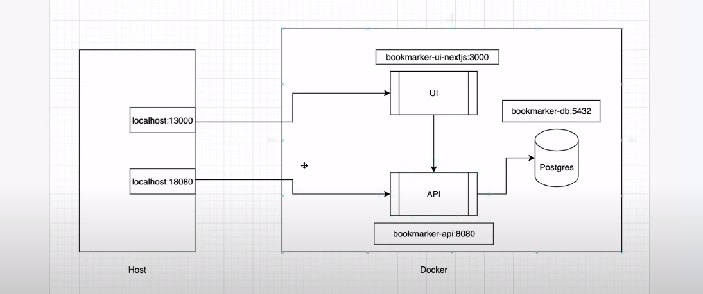
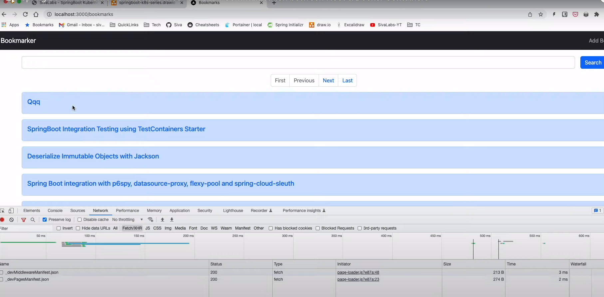
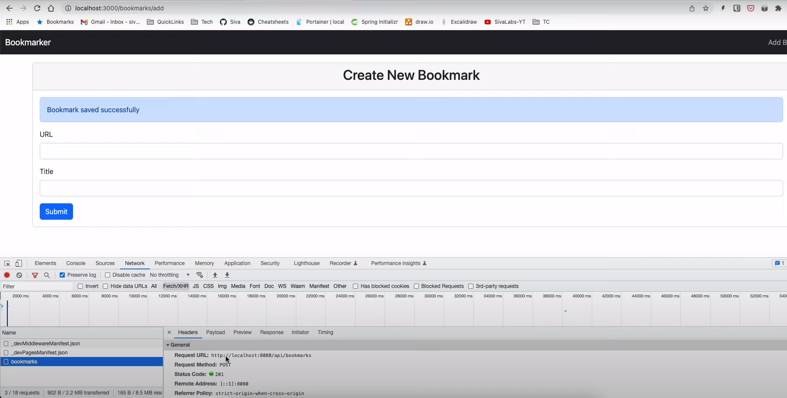

1. Tools used

   | framework / library / tool          | purpose                                                                                                                                                        |
   |-------------------------------------|----------------------------------------------------------------------------------------------------------------------------------------------------------------|
   | NextJS                              | [what is nextjs?](https://nextjs.org/learn/foundations/about-nextjs/what-is-nextjs)                                                                            |
   | Axios                               |                                                                                                                                                                |
   | Bootstrap                           |                                                                                                                                                                |
   | yarn                                |                                                                                                                                                                |
   | npm                                 |                                                                                                                                                                |
   | ReactJS  (explored / not used)      | [what is nextjs?](https://nextjs.org/learn/foundations/about-nextjs/what-is-nextjs)  and [what is reactjs?](https://legacy.reactjs.org/tutorial/tutorial.html) |
   | React Router (explored / not used)  |                                                                                                                                                                |


<br/>

2. [Single Page Applications](https://en.wikipedia.org/wiki/Single-page_application):


              a. previously applications used to return entire index.html whenever 
                 user performed page transitions on UI 


              b. browser which is a client gets this index.html of "Content-Type: text/html" (for google.com)
                 from the server and renders it 


              c. most of the time the navbar/header and other parts of html does not change
                 so in single page applications, the react/javascript code that we write sits with browser
                 client (like a plugin for our server) and exchanges json data for most parts and 
                 updates the html / presentation of the page with code on the browser 
          
   Refer: [Introduction to ReactJs & NextJs](https://youtu.be/x5KMRG3bt1Q)

<br>

3. [Quick Starter: Covers 80% Concepts of React you use DAILY](https://react.dev/learn)

<br>

4. React setup and run commands  

   ```bash
    
    # setup project <appName> with typescript files instead of javascript 
    $ npx create-react-app <appName> --template typescript
   
    # run the app
    $ cd <appName>
   
   
    /path/to/appName $ npm start
   ```
<br>

5. A React component should return a JSX with exactly one root node

   ```jsx
        // A JSX component should have a single root node
        // if you have multiple root nodes, like:
         
           return (
              <p> Root1 </p>
              <p> Root2 </p>
           )
         
        // then wrap them inside a div:
        
        
           return (
             <div>
                <p> Root1 </p>
                <p> Root2 </p>
             </div>
           )
   ```
<br>


6. [reactrouter.com](http://reactrouter.com) website and content is updated from the time of recording of
    [Intro to ReactJS & NextJS](https://youtu.be/x5KMRG3bt1Q). The command to set up react-router
    from the [Intro to ReactJS & NextJS](https://youtu.be/x5KMRG3bt1Q) is: 
    ```bash
     $ npm install react-router-dom@6
    ```

<br>

7. [NextJS](https://nextjs.org/) is a framework built on React (webpage says it is <em>React framework</em>)
   One of the primary reasons people opt for NextJS is server-side rendering.
   React offers client-side rendering which may not work well when building public facing applications
   which need SEO support. With NextJS there are some optimizations that can be leveraged due to server
   side rendering for initial page loads and based on components/page configurations it either performs client-side or
   server side rendering.

<br>  

  ```bash
    # command to create nextjs app with typescript
    $ npx create-next-app <appName> --ts 


    $ cd <appName>
    /path/to/appName $ npm i bootstrap@5.2.0 
    /path/to/appName $ yarn add axios


    $ yarn dev # alternatively, npm start may work
  ```

   follow the choices shown [*in this stackoverflow link](https://stackoverflow.com/a/76318637) 

<br>


   ```tsx
        import {NextPage} from "next";
       
        const Home: NextPage = () => {
             return (
                   <div>
                      <h1>Welcome to Bookmarker UI (NextJS)</h1>
                      <button className={"btn btn-primary"} /> 
                   </div>
             )
        }
       
        export default Home
   ```


<br>

8. [React with Typescript Function Components](https://www.digitalocean.com/community/tutorials/react-typescript-with-react#functional-components)


<br>


9. Bootstrap components used:
   <br>
   a. [Forms](https://getbootstrap.com/docs/5.3/forms/overview/)
   <br>
   b. [Pagination](https://getbootstrap.com/docs/5.3/components/pagination/)
   <br>
   c. [NavBar](https://getbootstrap.com/docs/5.3/components/navbar/)
   <br>
   d. [Card](https://getbootstrap.com/docs/5.3/components/card/)
   <br>
   e. [Alert](https://getbootstrap.com/docs/5.3/components/alerts/)
   <br>
   f. [Button](https://getbootstrap.com/docs/5.3/components/buttons/)

<br>

10. [CORS](https://developer.mozilla.org/en-US/docs/Web/HTTP/CORS): Same Origin Policy

<br>

11. *Data Fetching:





When we run `bookmarker-ui-nextjs` server, the browser gets some of the JS/CSS/HTML bundled. When we say client
we mean this code which is executed by the browser. And when we say server we mean ui-server.

<br>

So `client ->  (JS/CSS/HTML code executed on browser from the device of user)` <br>
and `server -> bookmarker-ui-nextjs:3000`
<br>
<br>


The bookmark listing page is server side rendered - meaning when you visit the `/bookmarks` 
endpoint, the `bookmarker-ui-nextjs` server makes a call to `bookmarker-api` and sends the populated
`index.html` along with `CSS/JS` in a bundle to browser. So when you open the network tab you do not 
see any API call being made to `bookmarker-api` from browser.

Note we use the [getServerSideProps()](https://nextjs.org/docs/pages/building-your-application/data-fetching/get-server-side-props)
function in `index.ts`



Whereas, the `/bookmarks/add` endpoint is client side rendered, meaning the `HTML/CSS/JS` code sent
as a bundle to the browser on user's device makes a direct API to `bookmark-api` and renders
the page in the browser without contacting `bookmarker-ui-nextjs`




<em>Server Side Rendering</em>: Client makes call to ui-server (which may again make a call to backend) to get data
<br>
<em>Client Side Rendering</em>: Some pages like a form have no data to begin with,
                                can be rendered by client right away. Only when 
                                a user fills the form and submits, it has to pass the 
                                data to server
<br>
<em>Static-site generation</em>:A blog with static content (html, css, images, markdown) is a
                                good example, where there are no updates / write operations 
                                to a server

<br>

<em>Read the following links:</em> <br/>

* [Fetching data from the server](https://developer.mozilla.org/en-US/docs/Learn/JavaScript/Client-side_web_APIs/Fetching_data)
* [Rendering pattern options](https://www.freecodecamp.org/news/rendering-patterns/)
* [NextJS Data Fetching Methods | geeks](https://www.geeksforgeeks.org/next-js-data-fetching-methods/)
* [NextJS Data Fetching Docs](https://nextjs.org/docs/pages/building-your-application/data-fetching)

