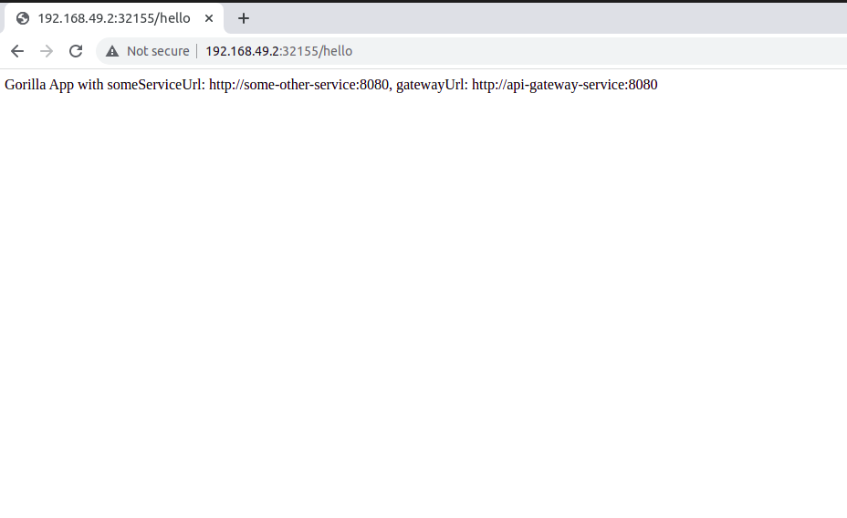

# Deploy a Spring Boot App on Minikube Locally 

The aim of this repository is to get started with kubernetes
by deploying a hello world spring boot app named gorilla


### Result

Exposed spring boot application as a service on minikube k8s cluster running locally.

The definitions for service, deployment can be found at <em>k8s/service.yaml</em>, <em>k8s/deployment.yaml</em> and 
<em>k8s/configmap.yaml</em> is used for externalized configuration


### Future Work

Add comments to explain settings in k8s/yaml files 

[Deploy a spring boot crud app in k8s with minikube](https://www.youtube.com/watch?v=pIPji3_rYPY)


### Steps:

1.  Install minikube 

    [curl script](https://minikube.sigs.k8s.io/docs/start/) 

    minikube has its own docker daemon / engine 
    you have to use THIS to create container images 
    and make services out of them. You do that by

    ```bash
      $ minikube start

      $ eval $( minikube docker-env )  # after this command, docker commands apply on minikube  docker engine
    ```

     in this shell environment docker refers minikube's docker engine
     and not the docker engine that you may have installed


2. Create image from root folder of project

   ```bash
   
   /path/to/gorilla$  mvn clean package -Dmaven.test.skip  # check target folder created with gorilla.jar
   
   /path/to/gorilla$ docker build -t gorilla .  # docker login with docker-hub credentials maybe needed to pull opendjdk image
   
       Sending build context to Docker daemon  19.87MB
       Step 1/4 : FROM openjdk:8-jdk-alpine
       ---> a3562aa0b991
       Step 2/4 : VOLUME /tmp
       ---> Using cache
       ---> 3a8b285f12f6
       Step 3/4 : COPY target/*.jar app.jar
       ---> f93f9bf0eb9b
       Step 4/4 : ENTRYPOINT ["java","-jar","/app.jar"]
       ---> Running in accfd70c1cff
       Removing intermediate container accfd70c1cff
       ---> 563f623675cb
       Successfully built 563f623675cb
       Successfully tagged gorilla:latest
     
   /path/to/gorilla$ kubectl apply -f ./k8s/
   
       service/gorilla created
       configmap/gorilla-config created
       deployment.apps/gorilla created

   /path/to/gorilla$ kubectl get all 
   
       NAME                         READY   STATUS    RESTARTS   AGE
       pod/gorilla-c944df97-48mqg   1/1     Running   0          2m8s
       
       NAME                 TYPE        CLUSTER-IP       EXTERNAL-IP   PORT(S)          AGE
       service/gorilla      NodePort    10.105.189.207   <none>        8080:31880/TCP   2m8s
       service/kubernetes   ClusterIP   10.96.0.1        <none>        443/TCP          7m37s
       
       NAME                      READY   UP-TO-DATE   AVAILABLE   AGE
       deployment.apps/gorilla   1/1     1            1           2m8s
       
       NAME                               DESIRED   CURRENT   READY   AGE
       replicaset.apps/gorilla-c944df97   1         1         1       2m8s

   /path/to/gorilla$ minikube service --url gorilla  # also try:  minikube service gorilla
   
        http://[ip:][port]
   ```
 
   Visit  http://ip:port/hello from your browser
   

3. ```$ kubectl port-forward service/gorilla 8080:8080``` to access the service on <em>localhost:8080</em> 

4. ```$ minikube delete``` can be handy to delete the k8s cluster / teardown


### Output Screenshot 



### References: 


1. [Stackoverflow link](https://stackoverflow.com/a/66598466)


2. [Spring-on-kubernetes-topical-guide](https://spring.io/guides/topicals/spring-on-kubernetes/)


3. [Spring-boot-docker-topical-guide](https://spring.io/guides/topicals/spring-boot-docker/)


4. [Kubernetes labs](https://labs.play-with-k8s.com/)


5. [How-to-deploy-dockerized-app-to-kubernetes](https://medium.com/@sarathtchander/how-to-deploy-dockerized-spring-boot-app-in-k8s-minikube-for-beginners-378a1b0df153)


6. [Spring-boot-apps-with-minikube-baeldung](https://www.baeldung.com/spring-boot-minikube?__cf_chl_tk=VCvE1u0lEkyeKZktAeYlQ__9UlWl6WNX6CV5EajGECg-1638361741-0-gaNycGzNCJE)


8. [Edit-deployment-imagepullpolicy-never](https://www.talkingdotnet.com/how-to-run-locally-build-docker-images-with-kubernetes/)


7. [Minikube-and-docker-common-registry](https://www.bogotobogo.com/DevOps/Docker/Docker_Kubernetes_Minikube.php)
