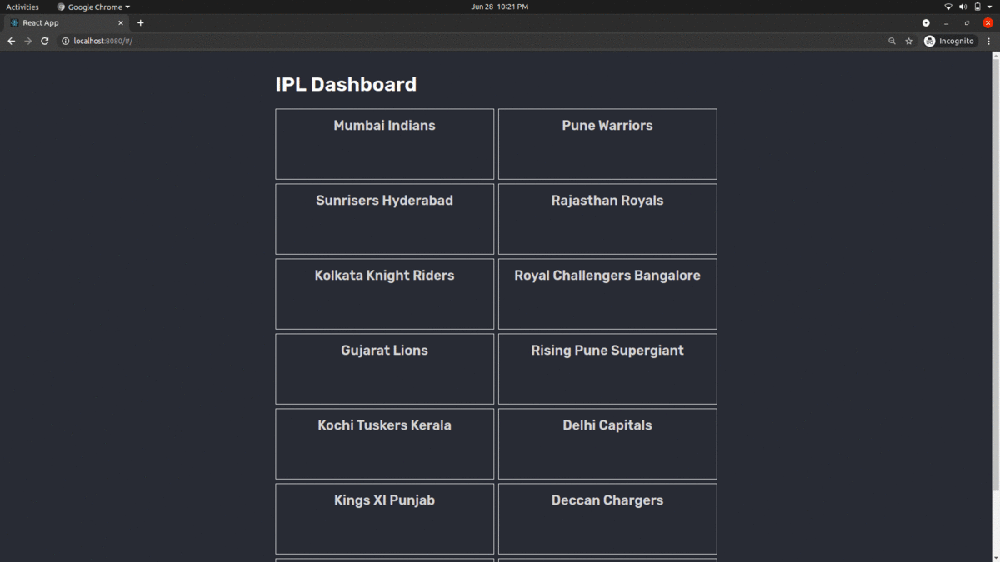

# IPL Dashboard 

This project is the result of the hands-on learning series [IPL Dashboard - Spring Boot + React Full Stack development](https://www.youtube.com/playlist?list=PLqq-6Pq4lTTa8V613TZhGq4o8hSgkMGQ0) from the youtube channel [JavaBrains](https://www.youtube.com/c/JavaBrainsChannel) 


The goal is to start working with technologies mentioned below by using them to build a useful application

The functionality of the app is to present a simple IPL dashboard. The dataset taken from Kaggle is used to 
show match summary of most recent games played by each IPL team.


## Techstack and Data source


| TechStack / Data source | Remarks                                                                                                                        | 
|-------------------------|--------------------------------------------------------------------------------------------------------------------------------|
| `Dataset`               | [IPL Matches 2008-2020.csv](https://www.kaggle.com/patrickb1912/ipl-complete-dataset-20082020?select=IPL+Matches+2008-2020.csv) |
| `Spring Batch`          | To read CSV data into In-Memory HSQL Database                                                                                  |
| `ReactJS`               | To build dashboards for matches and teams                                                                                      |
| `Amazon BeanStalk`      | To deploy the application                                                                                                      |


## Screenshots 





## To Build and Run 


Make sure you have yarn and JDK-11 installed 


```bash

    # go to src folder in the project
    $ cd path/to/ipl-dashboard/src 

    # delete the contents of public directory
    $ rm -rf ./main/resources/public/* 

    # go to frontend folder in the project 
    $ cd  frontend  

    # build frontend code  
    $ yarn build 

    # go to project root folder 
    $ cd  ../.. 

    # build backend code 
    $ ./mvnw install  

```

The target folder has the *ipl-dashboard-0.0.1-SNAPSHOT.jar* file


To run the application locally

```bash

   # go to the root folder of project 
   $ cd path/to/ipl-dashboard

   $ java -jar ./target/ipl-dashboard-0.0.1-SNAPSHOT.jar 

```

Open your browser and visit http://localhost:8080


## Future Work 

* Add a feature to the application and Submit a PR on the official github repo of the project 


## References


* [IPL-Dashboard-youtube-series](https://www.youtube.com/playlist?list=PLqq-6Pq4lTTa8V613TZhGq4o8hSgkMGQ0)

* [IPL-Dashboard-official-github-repo](https://github.com/koushikkothagal/ipl-dashboard)

* [IPL Matches 2008-2020.csv](https://www.kaggle.com/patrickb1912/ipl-complete-dataset-20082020?select=IPL+Matches+2008-2020.csv)

