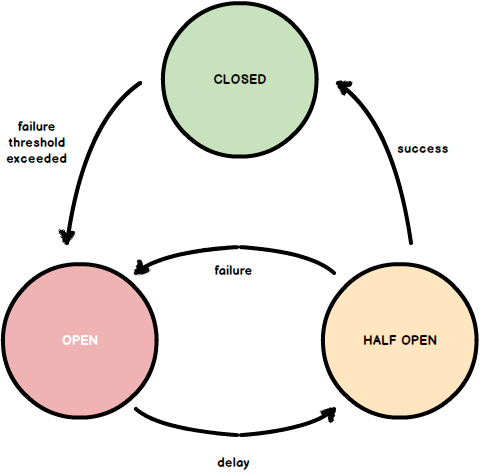
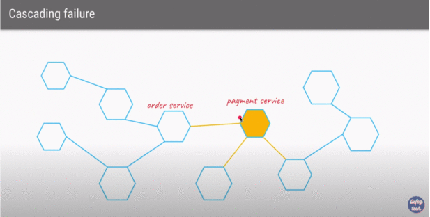

## Resilience4j 

This code is taken from  [Resilience4j Tutorial, Daily Code Buffer](https://www.youtube.com/watch?v=9AXAUlp3DBw),
the goal is to understand the fault-tolerance modules provided by resilience4j library hands-on:
   - circuit breaker
   - retry 
   - rate limiter

### What is circuit breaker ?

   It can be thought of as a request interceptor, it follows the following state diagram:

   

   By default it is in CLOSED state and it allows the client to make calls to the service. 
   
   In case a failure threshold is reached it goes to OPEN state in which it does not allow client to
   make calls to service and a fallback method can be used 

   It is usually configured to go to HALF-OPEN state after some time-interval. 
   
   In HALF-OPEN state, after a configured number of calls are made, the failure threshold is consulted to
   determine whether circuit-breaker goes to CLOSED state or OPEN state.

### Why we need circuit breakers ?

  [Use of the Circuit Breaker pattern](https://spring.io/guides/gs/cloud-circuit-breaker) can:

       1. allow a microservice to continue operating when a related service fails,

       2. preventing the failure from cascading and

       3. giving the failing service time to recover.
 

  

### Other Fault-tolerant modules explored

  <em>Retry</em> module performs retry when a client request fails to connect to server,  
  it results in success / failure when number of retry attempts reach configured limit

  <em>RateLimiter</em> module is used to protect the endpoint from spikes in request traffic /
  DDoS attacks. The endpoint will be hit only if the traffic rate meets configured conditions.

### Simulation

   In this repository we have ServiceA which calls ServiceB. 
   
   The code adds circuit breaker / retry on ServiceA endpoint that makes a client call to ServiceB and
   circuit breaker behaviour is observed on `http://localhost:8080/actuator/healh` by manually shutting down
   ServiceB and re-running it.

   All the code for resilient4j is present only in ServiceA.
  
   <em> src/main/resources/application.yml </em> has comments that explain the configurations for 
        circuit breaker state transitions

## References

1. [Resilience4j Tutorial | Daily Code Buffer | Youtube](https://www.youtube.com/results?search_query=resilience4j+daily+code+buffer)

2. [shabbirdwd53/resilience4j GitHub](https://github.com/shabbirdwd53/resilience4j): 
   <em>Code is taken from this reference</em>

3. [Circuit Breaker Article By Martin Fowler](https://martinfowler.com/bliki/CircuitBreaker.html)

4. [Circuit Breaker Pattern - Fault Tolerant Microservices | Defog Tech | Youtube ](https://www.youtube.com/watch?v=ADHcBxEXvFA): 
   <em>Cascading failure gif is taken from this reference</em>

5. [What is CircuitBreaking in Microservices | Narendra L | Medium](https://medium.com/@narengowda/what-is-circuitbreaking-in-microservices-2053f4f66882):
   <em>Circuit breaker state diagram taken from this reference</em>

6. [Resilience4j docs for configuration](https://resilience4j.readme.io/docs)
