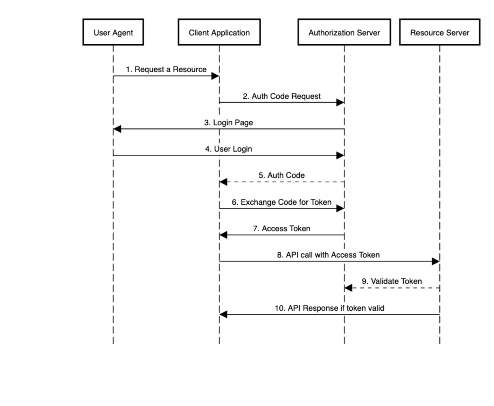

The aim of the repository is to understand and implement authentication and authorization using spring security library 
and oauth2 protocol.<br> The code for this repository is taken from [Spring Security Full Course | Daily Code Buffer](https://www.youtube.com/watch?v=tWcqSIQr6Ks&t=3523s)

### Setup

Add following entries to /etc/hosts file  
```
127.0.0.1	provider-oauth-auth-server
127.0.0.1       oauth-client-app
127.0.0.1       provider-oauth-resource-server
127.0.0.1       provider-signup-service
```

 ### Notation

<br>

| Spring-boot-module                  |   Oauth2 component in call flow diagram               |
|-------------------------------------|:-----------------------------------------------------:|
| oauth-client                        |        Client Application                             |
| provider-oauth-authorization-server |        Authorization server                           |
| provider-oauth-resource-server      |         Resource Server                               |
| provider-signup-service             |                                                       |

<br>
<br>
And the user of oauth-client app is Resource Owner, in the call flow diagram it is User-Agent




<br>
<br>
 For jwt public private key info: http://provider-oauth-auth-server:9000/oauth2/jwks

<br>
<br>

### References: 


1. [Spring Security Full Course | Daily Code Buffer](https://www.youtube.com/watch?v=tWcqSIQr6Ks&t=3523s)

2. [What is OAuth2 ?](https://auth0.com/intro-to-iam/what-is-oauth-2/)  and [List of Notable OAuth2 Providers](https://en.wikipedia.org/wiki/List_of_OAuth_providers)

3. [Registration Flow Article](https://www.youtube.com/redirect?event=video_description&redir_token=QUFFLUhqbFQtOWhxaE5aelc2WnVVdS1ETDV0eWIxc09ZQXxBQ3Jtc0tuN1JXdG9Oa0QzcVVTLVVycV9scjRXdThYajFnY1R2TS1Ga2xjdmhreURsSlQ4czdTZnlHU0ptdzUzQU0yc2JWRVI5Um5VSXY1Z2VicWhQUzk4MjNKRGE3N2ppSmlrMFZyV28wZXVoWVMybVVlV0lCNA&q=https%3A%2F%2Fwww.baeldung.com%2Fregistration-with-spring-mvc-and-spring-security) <br>
     Recommended by reference (1) to explore registration flows

4. [Spring Security using OAuth2 in Spring Boot | Tech Primers](https://www.youtube.com/watch?v=Dbxzw0cpxBU)

5. [Spring Security with JWT: OAuth 2 Resource Server | dev.to](https://dev.to/toojannarong/spring-security-with-jwt-the-easiest-way-2i43): for tracing oauth2 call flows 

6. [Logging Spring Security](https://stackoverflow.com/questions/30855252/how-do-i-enable-logging-for-spring-security): for debugging to trace oauth2 call flows

7. [Learn About Oauth2 | Okta](https://www.oauth.com/)

8. [Oauth2 Playground](https://www.oauth.com/playground/client-registration.html?returnto=authorization-code.html) : interactively shows oauth-client and oauth-server flow right from client registration 

9. [Spring Boot – OAuth2 Authorization and Resource Servers  HowToDoInJava](https://howtodoinjava.com/spring-boot2/oauth2-auth-server/): For tracing the oauth2 call flow

10. <em>OAuth 2.0 is an authorization protocol and NOT an authentication protocol</em>: [oauth2 authentication vs authorization (well explained) | stackoverflow](https://stackoverflow.com/a/33704657),
   [OAuth2 in Action | Manning](https://livebook.manning.com/book/oauth-2-in-action/chapter-13/11)

11. [Jpa-Entities](https://www.baeldung.com/jpa-entities): <br> 
          - [@Entity](https://stackoverflow.com/a/29333628) <br>
          -  [FetchType](https://stackoverflow.com/a/2991015)

12. [Value for column with type bit(1) not displayed in mysql shell](https://stackoverflow.com/a/14249348)
