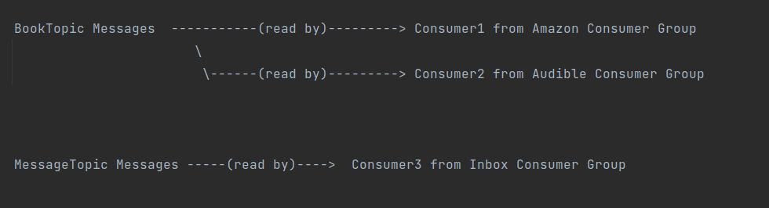
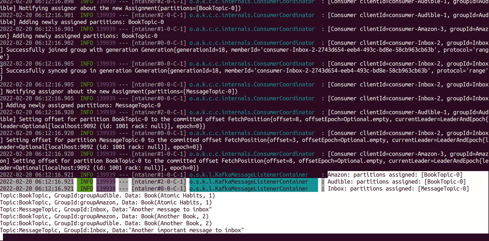

# Apache Kafka producer and consumer with spring boot

The aim of this repository is to get started developing with kafka using spring-kafka library and spring boot.
The code is taken from references mentioned below and can be used as a seed to experiment / play around with kafka.


### Next Step

 - [x] Use docker compose to simplify setting up
 - [ ] write tests

### Setup and Running

   1. Install docker

   2. Start zookeeper and kafka 
   
      ```bash   
        # clone and go to root directory of project
        $ git clone https://github.com/aditya-suripeddi/springboot-kafka.git
        $ cd /path/to/springboot-kafka
      
        /path/to/springboot-kafka$ docker-compose up
       ```


   3. To run <em>apache-kafka-consumer-demo</em> and <em>apache-kafka-producer-demo</em> you can use IDEs.

      If you prefer to run them from terminal without launching an IDE.
   
      ```bash
      
      # open a terminal 
      /path/to/springboot-kafka$ cd apache-kafka-consumer-demo
      /path/to/springboot-kafka/apache-kafka-consumer-demo$ mvn clean package && java -jar target/*.jar
      
      # open another tab in the terminal
      /path/to/springboot-kafka$ cd apache-kafka-producer-demo
      /path/to/springboot-kafka/apache-kafka-consumer-demo$ mvn clean package && java -jar target/*.jar
      ```
   
   5. Import the postman collection using which you can make REST API call to producer
      to publish message to kafka which is ready by consumer


## Code Contents

The <em>apache-kafka-producer-demo</em> project supports two endpoints -`/publish` and `/publish/{path-param}`
The `/publish` endpoint is used to publish book objects with json request payload and `/publish/{path-param}` is used
to publish text messages as json payload
 
           


There are <b>3 consumers</b> in <em>apache-kafka-consumer-demo</em> project that read messages 
published to BookTopic and MessageTopic:




### Screenshot of Output

On making requests to publish endpoints from postman, the logs of <em>apache-kafka-consumer-demo</em> shows
following output:




### References

1. [Kafka Producer | Daily Code Buffer](https://www.youtube.com/watch?v=wBGT7u_R-tw&t=464s)

2. [Kafka Consumer | Daily Code Buffer ](https://www.youtube.com/watch?v=80ngRl7RhCw&t=546s)

3. [Kafka Consumer | Tech Primer ](https://www.youtube.com/watch?v=IncG0_XSSBg)

4. [JsonDeserializer for Consumer | StackOverflow](https://stackoverflow.com/questions/54690518/spring-kafka-jsondesirialization-messageconversionexception-failed-to-resolve-cl)

5. [Intro Apache Kafka with Spring | Baeldung](https://www.baeldung.com/spring-kafka)

6. [techtter/springboot-kafka-docker](https://github.com/techtter/springboot-kafka-docker/) 