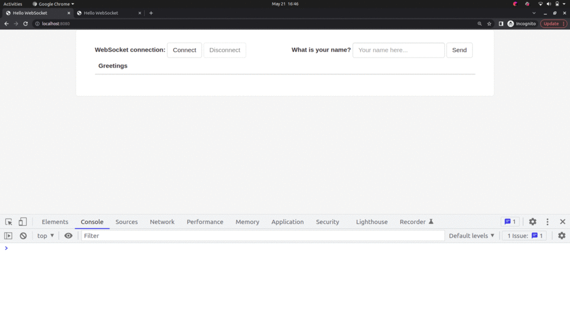

## spring-websocket

The aim of the repository is to understand how websockets can be used to build
interactive web applications

The code for this repository is taken from [spring.io/guides/gs/messaging-stomp-guides](https://spring.io/guides/gs/messaging-stomp-websocket/)
and [daily-code-buffer | Implementing websockets using spring boot](https://www.youtube.com/watch?v=n6ZqOwreFTA&t=363s)

# Output Screenshot

1. User named John connects to server to establish websocket connection and sends his name in tab1
2. We notice greeting with his name in tab1
3. User named Robert connects to server to establish websocket connection and sends his name in tab2
4. We observer that on tab1 server sends greeting for user Robert without any nudge from client on tab1
   like a push notification
  

# Next Step

Add time stamp and message from user as illustrated here https://www.baeldung.com/websockets-spring

Add unit tests
